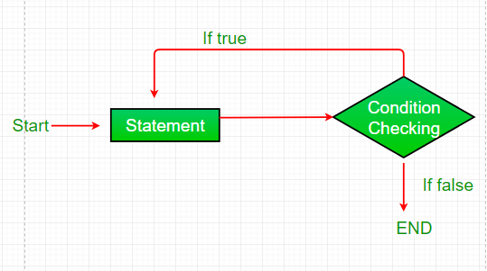

# Loops

Java provides three ways for executing the loops. While all the ways provide similar basic functionality, they differ in their syntax and condition checking time.

- While Loops.
- For Loops.
- Do-While Loops.

Lets check the differences between these.


## While Loops

- Syntax:

```
while (condition) {

    // Loop statements ...

}
```

- Flowchart:


- Example:

```java
public class LoopTester {
    int x;
    int y;
    
    public LoopTester(int firstNumber, int secondNumber) {

        x = firstNumber;
        y = secondNumber;

    }

    public static void main(String[] args) {

        LoopTester loopObject = new LoopTester(5, 10);
        loopObject.whileLoopMethod(loopObject.x, loopObject.y);
        
    }

    public void whileLoopMethod(int a, int b){

            while (a < b) {

                System.out.println(a);
                a++;

            }

    }
}
```

Output:

```
5
6
7
8
9
```

The method *whileLoopMethod* will check if the variable *a* is lower than the variable *b* first, and print the current value followed by adding 1 to the current until *a* is equal to 10. Once this happens, the condition returns false and the statement is exited.


## For Loops

- Syntax:

```
for (initialization condition; testing condition; increment/decrement) {

   // Loop statement(s) ...
   
}
```

- Flowchart:


- Example:

```java
public class LoopTester {
    int x;
    int y;

    public LoopTester(int firstNumber, int secondNumber) {

        x = firstNumber;
        y = secondNumber;

    }

    public static void main(String[] args) {

        LoopTester loopObject = new LoopTester(5, 10);
        // loopObject.whileLoopMethod(loopObject.x, loopObject.y);
        loopObject.forLoopMethod(loopObject.x, loopObject.y);

    }

    public void whileLoopMethod(int a, int b){

            while (a < b) {

                System.out.println(a);
                a++;

            }

    }

    public void forLoopMethod(int a, int b){

        for (int i = 0; i <= b; i++){

            System.out.println(a);
            a++;

        }

    }
}
```

Output:

``` 
5
6
7
8
9
10
11
12
13
14
15
```

The method *ForLoopMethod* will run for 10 times (value of *b*) and for each iteration is going to add 1 to the current value of *a* starting from 5 until the condition *a* <= *b* is met. At that point the loop is exited.

## Do-While Loops

- Syntax:

```
do {

   // Loop statements ...
    
} while (condition);
```


- Flowchart:




